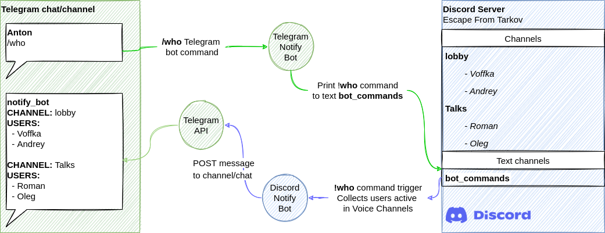

# DiscordNotifyBot
Motivation - this bot simply helps to know when your friends joined Discord Server without launching the Discord app and see who is online or asking them in messenger. You just always know who is online because notification sent automaticaly. Or you can just ask bot - `/who` is online.  

This Discord bot sends notifications to Telegram when member on Discrord server changes his status on a voice channel:
  - join/leave channel
  - muted/unmuted
  - other [events](https://github.com/Anton-Sagurov/discord-notify-bot/blob/main/config.yaml#L12).  
  
Also this bot handles the commands `/who` and returns the list of all active users joined any voice channel on Discrod Server.  

### How it works
There are 2 parts:
1. This Discord Notification Bot
2. [telegram-notify-bot](https://github.com/Anton-Sagurov/telegram-notify-bot)
#### User join event notification sent to Telegram channel/chat

#### Get active users on Discord server from Telegram channel/chat


### Notification events
As it was said - there is a list of [events](https://github.com/Anton-Sagurov/discord-notify-bot/blob/main/config.yaml#L12) that could send notifications to Telegram. The most useful and straightforward are - **join** and **last_user_logoff** events. The **last_user_logoff** event relates to all members on the server voice channels.

### Deployment
#### Run docker container
The docker image: `sagurov/discord-notification-bot:latest`

##### Run the bot
1. Export the `DISCORD_TOKEN` and `DISCORD_GUILD` environment variables
```bash
export DISCORD_TOKEN='XXXXXXXXXXXXXXXXXXXXXXXX.YYYYYY.zzzzzzzzzzzzzzzzzzzzzzzzzzz'
export DISCORD_GUILD='My awesome Discord server name'
```
2. Run the ds-notify-bot:
```bash
python -m ds-notify-bot
```

### Development
#### Requirements
Recommended python version >= 3.10

#### Install dependencies
```bash
python -m venv .venv
source .venv/bin/activate
python -m pip install -r ./requirements.txt
```
